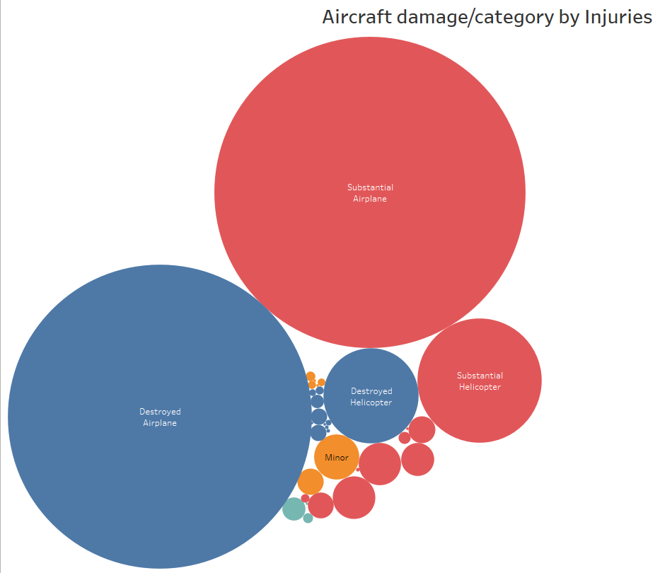

# Phase-1-project
For this project, you will use data cleaning, imputation, analysis, and visualization to generate insights for a business stakeholder.
## Business Problem
Your company is expanding in to new industries to diversify its portfolio. Specifically, they are interested in purchasing and operating airplanes for commercial and private enterprises, but do not know anything about the potential risks of aircraft. You are charged with determining which aircraft are the lowest risk for the company to start this new business endeavor. You must then translate your findings into actionable insights that the head of the new aviation division can use to help decide which aircraft to purchase.
## DATA CLEANING
With the data provided, in its raw state it would not be helpful analytically. The data has to be prepared, processed and statistically agreggated to make sense to the stakeholders. 
Simply put, It undergoes a few process thanks to our data handling technologies and it can there after be interpreted into information that can be understood with great ease.
This involves Loading of the data, getting and handling duplicates as well as missing data. Presenting the data visually 
## DATA VISUALIZATION
We are in a century where there's literally a technology for everything. To visualise the data we have , we have powerful tools that ease the process of creation of data visuals 

These are just but a few ways of visualising the data we have

#RECOMMENDATIONS
The data though about accidents, shows the number of common crafts used in the aviation industry. With this information it is easy to decide what planes to buy for what purpose.

## CONCLUSION
The aviatoin industry is a lucrative multi-billion dollar industry which will propell the company in a good direction financially
